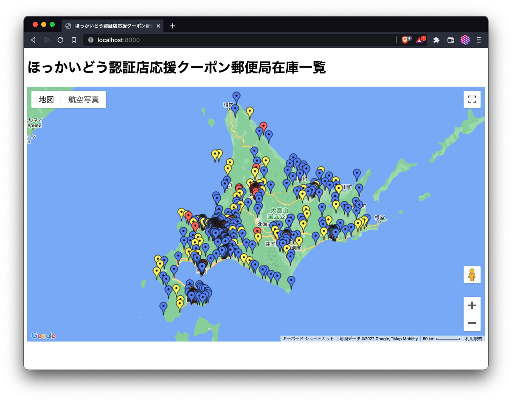
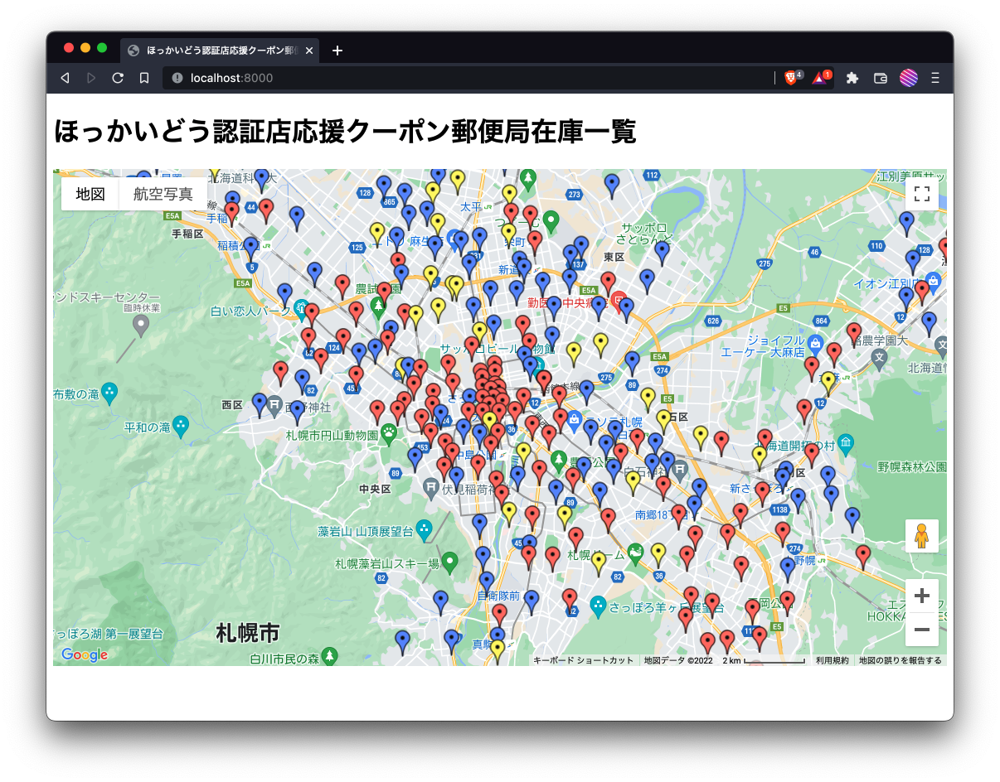
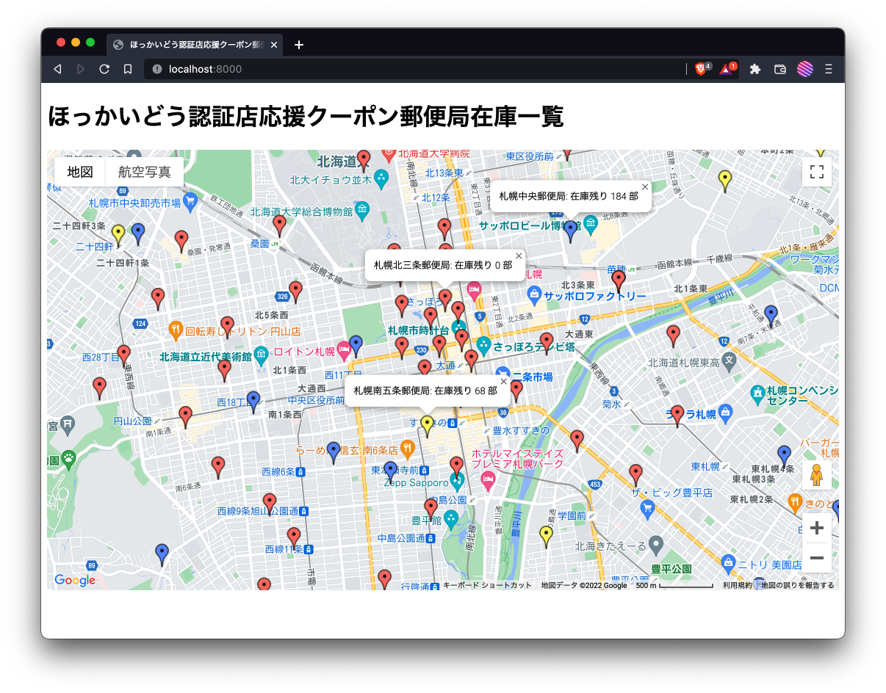

# `cheer_hokkaido_coupon`

ほっかいどう認証店応援クーポンの郵便局在庫状況を Google Map で可視化する

## 準備

* [https://camelot-py.readthedocs.io/en/master/user/install-deps.html#install-deps](このサイト)の通りに依存するパッケージをインストールする
    * ghostscript および tcl-tk
* Google Maps API Key を取得し、`google_maps_api_key.txt` というファイルを新規作成して Key の文字列を書き込む
    * `Maps JavaScript API` を有効にする
    * 具体的な取得方法は検索すれば出てくるので割愛
* Python 依存パッケージのインストール
    * `> pip install -r requirements.txt`

## 動かし方

* `> make scrape`
    * ほっかいどう認証店応援キャンペーンのサイトから在庫一覧のPDFをダウンロードする
        * `zaiko.pdf` という PDF ファイルが生成される
    * ダウンロードしたPDFを読み込んで、郵便局名・住所・在庫数の一覧を得る
    * 得られた住所から Google Maps API を用いて緯度経度を得る
    * 上記のデータを JSONL ファイルにして出力する
        * `output.jsonl` という JSONL ファイルが生成される
* `> make http`
    * Google Map の画面を用意する
    * JSONL ファイルを読み込んで、Google Map 上のマーカーを生成する
    * 上記を表示する HTTP サーバ（FastAPI）を立ち上げる
* Webブラウザで [http://localhost:8000/](http://localhost:8000/) にアクセスする

## 問題点

* GCP の Google Maps API Key のアクセス制限について
    * `make scrape` をやる場合には、`IP アドレス` の制限にして、自分の global IP address を許可した方が良い
    * `make http` をやる場合には、`HTTP リファラー` の制限にして、`http://localhost:8000/` を許可した方が良い
    * これらの設定は、GCPコンソール画面 → APIとサービス → 認証情報の画面に行き、API キーから Maps API Key を選び、アプリケーションの制限を設定する

## サンプル

